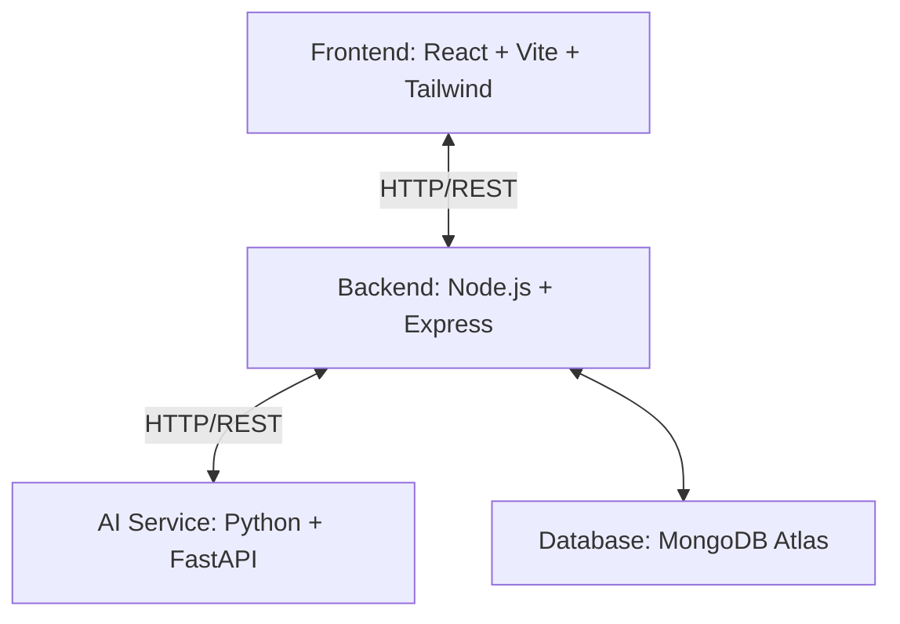

# Global Event Finder

An AI-powered event discovery platform for a college IR/ML course project.

## Project Architecture

The system consists of three independent services communicating over REST APIs:



- **Frontend (`/frontend`)**: React application bundled with Vite and styled using Tailwind CSS. It communicates directly with the Express backend.
- **Backend (`/backend`)**: Node.js & Express server. It handles client requests, performs database operations on MongoDB Atlas, and forwards NLP/ML tasks to the AI Service. It does not perform any NLP or ML tasks directly.
- **AI Service (`/ai-service`)**: Python microservice built using FastAPI. It implements NLP, TF-IDF calculation, cosine similarity comparison, text classification, and trend detection.

---

## How to Run Locally

Each service runs independently in its own folder.

### 1. Frontend Setup & Run
```bash
cd frontend
npm install
npm run dev
```
- Access the frontend in your browser at `http://localhost:5173`.

### 2. Backend Setup & Run
```bash
cd backend
npm install
npm run dev
```
- The backend runs at `http://localhost:5001`.
- Nodemon is configured to watch for changes and restart automatically.

### 3. AI Service Setup & Run
```bash
cd ai-service
# Create a virtual environment
python3 -m venv venv
source venv/bin/activate

# Install dependencies
pip install -r requirements.txt

# Run the FastAPI server
uvicorn main:app --reload
```
- The AI Service runs at `http://localhost:8000`.

---

## Environment Variables

Each directory contains a `.env.example` file demonstrating the required environment variables. **Do not commit actual `.env` files to git.**

- **/frontend/.env.example** contains variables like `VITE_API_URL` (points to the backend).
- **/backend/.env.example** contains variables like `PORT`, `MONGO_URI`, and `AI_SERVICE_URL`.
- **/ai-service/.env.example** contains variables like `PORT`, `MONGO_URI`, etc.
